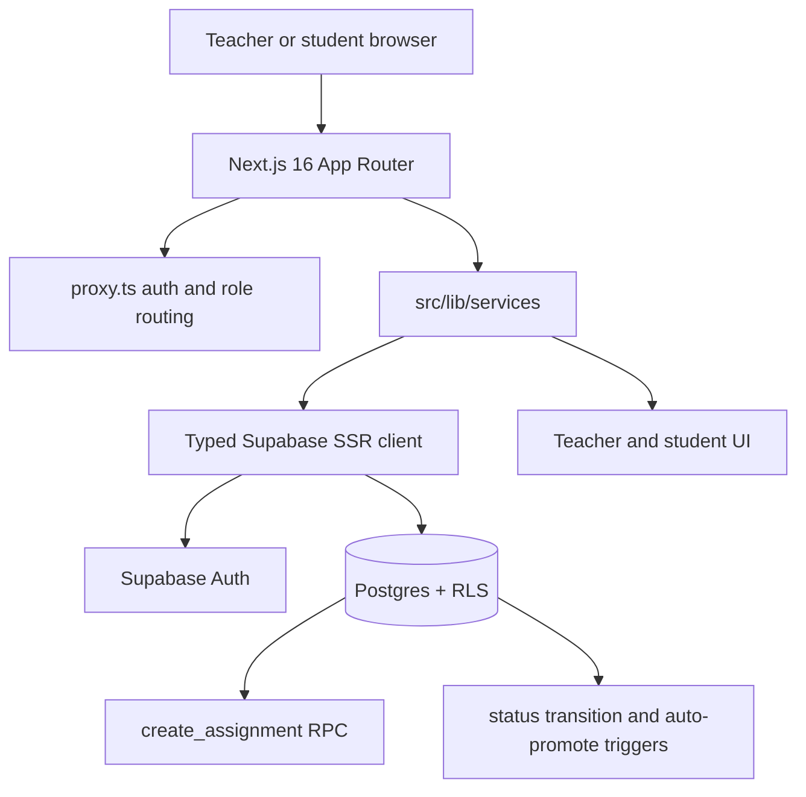

# Reading Assignment Portal

Next.js 16 + Supabase app for assigning public-domain books to classrooms, tracking student reading sessions, and showing teacher progress dashboards.

## Stack

- Next.js 16.2 App Router with `proxy.ts` for auth redirects
- React 19 and TypeScript strict mode
- Supabase Postgres, Auth, RLS policies, SQL migrations, and seed data
- Server Actions for service-layer writes
- Vitest for pure service helper coverage

## Architecture



The app keeps database access inside `src/lib/services/*`. UI components call service functions, while Postgres enforces authorization with RLS and protects state transitions with triggers.

## Setup

1. Install dependencies:

```bash
npm install
```

2. Copy environment variables:

```bash
cp .env.example .env.local
```

Set:

```bash
NEXT_PUBLIC_SUPABASE_URL=...
NEXT_PUBLIC_SUPABASE_ANON_KEY=...
```

3. Apply database SQL in order:

```text
supabase/migrations/01_schema.sql
supabase/migrations/02_fix_rls_fanout_and_policies.sql
supabase/seed.sql
```

4. Start the app:

```bash
npm run dev
```

Open `http://localhost:3000`.

## Demo Accounts

All demo users use password `Demo1234!`.

| Role | Email | Notes |
| :--- | :--- | :--- |
| Teacher | `teacher1@demo.com` | English Lit Homeroom, students 1-4 |
| Teacher | `teacher2@demo.com` | Creative Reading, students 4-6 |
| Student | `student1@demo.com` | Class 1 assignments |
| Student | `student4@demo.com` | Enrolled in both seeded classes |

## Key Behavior

- Teachers create assignments through `public.create_assignment(...)`, an atomic RPC that creates the assignment and fans out student progress records in one transaction.
- Students do not see soft-deleted assignments.
- Opening the reader marks `not_started` records as `in_progress`.
- Reading sessions are append-only. Dashboard minutes are derived from session rows.
- “Logged late” appears when any session was logged after the assignment due date.
- Status transitions follow the database rule: progress cannot revert to `not_started`.

## Testing

Run unit tests:

```bash
npm run test
```

Run type and lint checks:

```bash
npx tsc --noEmit
npm run lint
```

Run a production build:

```bash
npm run build
```

Current unit coverage includes:

- Zod validation for login-adjacent assignment/session inputs
- All 9 assignment status transitions
- Reading minute aggregation and late-log detection

## Manual Verification Checklist

Use a freshly seeded database before browser checks.

1. Sign in as `teacher1@demo.com`.
2. Confirm only Teacher 1 assignments are visible.
3. Create a new assignment and verify it appears with progress rows for the full class roster.
4. Archive an assignment and verify the confirmation names the real book title.
5. Sign out and sign in as `student1@demo.com`.
6. Confirm archived assignments are hidden.
7. Open a `not_started` book and confirm it becomes `in_progress`.
8. Log a reading session and confirm minutes update.
9. Confirm overdue assignments with after-due-date logs show `Logged late`.
10. Probe RLS by signing in as Teacher 2 and confirming Teacher 1 classroom data is not visible.

## Production Triage

| Area | Current implementation | Production direction |
| :--- | :--- | :--- |
| Rostering | Static seed data | SIS integration such as Clever, ClassLink, or Google Classroom |
| Content | Public-domain excerpts in Postgres | Licensed content pipeline with CDN-backed EPUB/PDF delivery |
| Reading telemetry | Active tab timer and append-only session logs | Offline queue, sync conflict handling, scroll checkpoints, comprehension prompts |
| Authorization | Supabase RLS and route proxy | Keep RLS; add audit logging, admin roles, and policy regression probes in CI |
| Assignment creation | SQL RPC fan-out | Keep RPC; add retry-safe idempotency keys for external integrations |
| AI vocabulary helper | Deterministic mock dictionary endpoint | Moderated LLM flow with grade-level controls, caching, observability, and fallback definitions |
| Testing | Unit tests plus manual browser/RLS checklist | Add Playwright teacher/student flows and automated Supabase policy tests |
| Operations | Manual SQL apply and seed | Managed migrations, preview database branches, and repeatable reset scripts |

## AI Usage

AI assistance was used to accelerate implementation and documentation, but the important decisions were reviewed against the running codebase and database schema. In particular, the database contract, RLS boundaries, Next 16 `proxy.ts` migration, type checks, and unit tests were verified locally instead of accepted from generated code. The vocabulary endpoint is a mock AI-style feature, not a live LLM integration.
